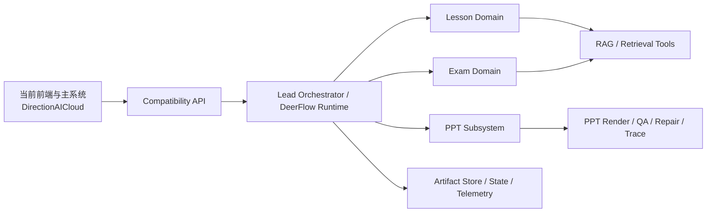

# AI 后端技术文档

## 1. 文档定位

这份文档定义的是当前仓库的技术边界、模块职责、仓库组织方式和重构路线。

它要回答的核心问题是：

- 应该新建仓库，还是直接在当前仓库里大改
- 当前 `DirectionAICloud`、仓内 `pptagent`、外部 `directionai_pptagent`、`evoagentx`、`python-backend` 应该如何取舍
- DeerFlow 该负责什么，不该负责什么
- 教案、试卷、PPT 三条链应该怎样组织
- 后续代码目录、依赖方向、artifact 和状态机应该怎样定义

如果后续修 bug 时发现：

- 问题本质上是边界不清、依赖方向混乱、契约漂移、状态机不稳
- 某个模块到底应该放在哪里有争议
- 某个能力应该是 Agent、Skill、Tool 还是独立子系统说不清

应先修改这份文档，再改代码。

## 2. 先给架构结论

### 2.1 推荐方案

当前仓库 `directionai-agent-backend` 就是推荐方案的落地结果。

它负责未来的 AI 教案、试卷、PPT 后端。

当前 `DirectionAICloud` 继续保留：

- 前端页面
- Java 主后端
- Go 用户服务
- Nginx 和部署入口
- 联调环境

### 2.2 为什么不建议直接在当前仓库大改

当前 `DirectionAICloud` 是一个大 monorepo，至少同时承载了：

- `evoagentx/`
- `python-backend/`
- `pptagent/`
- `java-backend/`
- `user-service/`
- `remotion-renderer/`
- `nginx/`
- 监控、数据库初始化、CI/CD 等配套部分

如果直接在这个仓库里大改 AI 后端，会出现几个问题：

1. AI 重构与非 AI 模块耦合过重
2. 很难清晰区分“兼容旧前端的适配层”和“新的 AI 核心引擎”
3. 很难沉淀专门的 AI 工程规范、测试体系和目录结构
4. 很容易为了迁就当前目录，继续把新旧逻辑混在一起
5. PPT 子系统已经在外部仓库有更成熟的结构，直接在当前仓库大改反而会把它拉回旧形态

### 2.3 DeerFlow 在当前仓库里的引入方式

当前仓库的基底代码来自 DeerFlow 2.0 最新源码拷贝。

本次引入遵循以下原则：

1. 保留当前仓库自己的 Git 历史和远端，不继承 DeerFlow 的 `.git`
2. DeerFlow 作为基底源码直接落在当前仓库根目录，而不是作为嵌套子目录
3. 后续需要同步上游 DeerFlow 时，按“显式对比、选择性迁移”的方式进行，不依赖隐式覆盖
4. 尽量减少对上游核心目录的侵入式改造，把 DirectionAI 自己的域逻辑放到独立位置

本次导入的 DeerFlow 上游 HEAD 为：

`8760937439e2722203f7d759414b667f20bbb285`

### 2.4 什么时候可以先在旧仓动

只有两类情况可以先在当前仓库直接改：

- 很短期的 PoC 验证
- 兼容层的小范围适配

但正式重构、多人协作、长期维护，仍建议落到新仓库。

## 3. 当前代码资产盘点与取舍

### 3.1 `evoagentx/`

当前作用：

- 教案生成
- 试卷生成
- PPT 生成
- 一部分 workflow JSON
- 一部分评估与 RAG 辅助能力

价值判断：

- 保留业务语义和经验
- 不必保留现有 workflow 组织方式
- 教案和试卷可以只借鉴其输入输出语义，不必照搬流程
- PPT 相关部分不作为未来主基线

推荐取舍：

- `lesson_generator.py`、`exam_generator.py` 保留业务参考价值
- `workflows/*.json` 不作为未来硬性结构
- 评估类文件可提炼规则，但不直接照搬目录结构

### 3.2 `python-backend/`

当前作用：

- FastAPI 单体入口
- RAG、Faiss、文档处理、导出、评估工具
- 业务工具模块

价值判断：

- 保留可复用的工具资产
- 不保留单体组织方式
- 是当前仓库中 `backend/packages/directionai/tools/`、领域服务层和适配层的重要来源

重点资产来源包括：

- `python-backend/pythonBackend/AI_teaching.py`
- `python-backend/pythonBackend/direction_ai_modules/llm_connector.py`
- `python-backend/pythonBackend/direction_ai_modules/ppt_maker.py`
- 其他文档处理、评估、抽取、存储工具

### 3.3 当前仓内 `pptagent/`

当前作用：

- 轻量的 PPT 服务与 vendor 封装

价值判断：

- 可以作为当前仓内过渡接口参考
- 不作为未来 PPT 主基线

### 3.4 外部 `/Users/sss/directionai/directionai_pptagent`

当前作用：

- 更成熟的 PPT 专用生成 harness

从目录上看，这个仓库已经具备：

- `backend/harness/agents`
- `backend/harness/runtime`
- `backend/harness/pipelines`
- `backend/harness/skills`
- `backend/models`
- `backend/tools`
- `docs/project_structure.md`
- `docs/technical_architecture.md`
- `workspace/outputs`
- `workspace/runtime_memory`
- `workspace/benchmarks`

价值判断：

- 这是未来 PPT 子系统的主基线
- 不应为了统一 DeerFlow 而放弃它的 runtime memory、repair、trace、benchmark、QA 能力

## 4. 当前仓库中的实际基底结构

当前仓库引入 DeerFlow 后，已经具备以下上游结构：

```text
directionai-agent-backend/
├─ backend/
│  ├─ app/
│  │  ├─ channels/
│  │  └─ gateway/
│  │     └─ routers/
│  ├─ packages/
│  │  └─ harness/
│  │     └─ deerflow/
│  ├─ docs/
│  └─ tests/
├─ frontend/
├─ skills/
├─ scripts/
├─ docker/
└─ docs/
```

这里要特别区分两个层次：

- `backend/packages/harness/deerflow/`
  这是 DeerFlow 上游核心 harness 的主要落点
- 当前仓库未来新增的 DirectionAI 业务域逻辑
  应尽量放在独立命名空间下，而不是直接和上游 DeerFlow 源码混写

## 5. 当前仓库建议采用的落地目录

为了既保留 DeerFlow 基底，又让 DirectionAI 的业务代码保持清晰，推荐在当前仓库中采用下面这种扩展方式：

```text
directionai-agent-backend/
├─ docs/
├─ backend/
│  ├─ app/
│  │  └─ gateway/
│  │     └─ routers/
│  │        ├─ compatibility_router.py
│  │        ├─ lesson_router.py
│  │        ├─ exam_router.py
│  │        └─ ppt_router.py
│  ├─ packages/
│  │  ├─ harness/
│  │  │  └─ deerflow/              # DeerFlow 上游核心
│  │  └─ directionai/              # DirectionAI 自有域逻辑
│  │     ├─ compat/
│  │     ├─ lesson/
│  │     ├─ exam/
│  │     ├─ ppt/
│  │     ├─ schemas/
│  │     ├─ tools/
│  │     ├─ storage/
│  │     ├─ telemetry/
│  │     └─ workflows/
│  └─ tests/
│     ├─ contracts/
│     ├─ integration/
│     ├─ regression/
│     └─ directionai/
├─ skills/
│  └─ directionai/
└─ examples/
```

### 5.1 完整项目目录树

如果后续要让别人只根据文档开始重构，优先以这里的目录树为准。

```text
directionai-agent-backend/
├─ README.md
├─ Install.md
├─ Makefile
├─ config.example.yaml
├─ docs/
│  ├─ README.md
│  ├─ requirements.md
│  ├─ architecture.md
│  ├─ engineering.md
│  └─ bug-policy.md
├─ backend/
│  ├─ app/
│  │  └─ gateway/
│  │     └─ routers/
│  │        ├─ compatibility_router.py
│  │        ├─ lesson_router.py
│  │        ├─ exam_router.py
│  │        └─ ppt_router.py
│  ├─ packages/
│  │  ├─ harness/
│  │  │  └─ deerflow/
│  │  │     ├─ agents/
│  │  │     ├─ community/
│  │  │     ├─ config/
│  │  │     ├─ guardrails/
│  │  │     ├─ mcp/
│  │  │     ├─ models/
│  │  │     ├─ reflection/
│  │  │     ├─ runtime/
│  │  │     ├─ sandbox/
│  │  │     ├─ skills/
│  │  │     ├─ subagents/
│  │  │     ├─ tools/
│  │  │     ├─ tracing/
│  │  │     ├─ uploads/
│  │  │     └─ utils/
│  │  └─ directionai/
│  │     ├─ compat/
│  │     ├─ lesson/
│  │     ├─ exam/
│  │     ├─ ppt/
│  │     ├─ schemas/
│  │     ├─ tools/
│  │     ├─ storage/
│  │     ├─ telemetry/
│  │     └─ workflows/
│  ├─ tests/
│  │  ├─ contracts/
│  │  ├─ integration/
│  │  ├─ regression/
│  │  └─ directionai/
│  ├─ pyproject.toml
│  └─ langgraph.json
├─ frontend/
├─ skills/
│  ├─ public/
│  └─ directionai/
├─ scripts/
├─ docker/
└─ examples/
```

### 5.2 目录树使用规则

这棵目录树的使用方式要固定下来：

- `backend/packages/harness/deerflow/` 是上游核心区，优先少改
- `backend/packages/directionai/` 是主开发区，教案、试卷、PPT 的领域逻辑主要放这里
- `backend/app/gateway/routers/` 只放 API、SSE、兼容入口
- `backend/tests/contracts/` 放前端兼容、SSE、tool/skill contract 测试
- `backend/tests/integration/` 放模块协作测试
- `backend/tests/regression/` 放复杂 bug 回归
- `skills/directionai/` 放 DirectionAI 自有 skill 资产
- `examples/` 放请求样例、结果样例、联调用例

### 5.3 最小实现文件建议

为了让别人拿着文档就能开始落代码，建议优先补齐下面这些文件：

```text
backend/app/gateway/routers/
├─ compatibility_router.py
├─ lesson_router.py
├─ exam_router.py
└─ ppt_router.py

backend/packages/directionai/compat/
├─ legacy_request_mapper.py
├─ legacy_response_mapper.py
└─ sse_event_mapper.py

backend/packages/directionai/lesson/
├─ lesson_schemas.py
├─ lesson_agents.py
├─ lesson_workflow.py
├─ lesson_service.py
└─ lesson_artifact_builder.py

backend/packages/directionai/exam/
├─ exam_schemas.py
├─ exam_agents.py
├─ exam_workflow.py
├─ exam_service.py
└─ exam_artifact_builder.py

backend/packages/directionai/ppt/
├─ ppt_schemas.py
├─ ppt_request_builder.py
├─ ppt_subsystem_adapter.py
├─ ppt_result_mapper.py
└─ ppt_trace_service.py

backend/packages/directionai/schemas/
├─ task_specs.py
├─ artifacts.py
├─ tool_result.py
└─ states.py

backend/packages/directionai/tools/
├─ rag_tool.py
├─ document_parser_tool.py
├─ lesson_export_tool.py
├─ exam_validation_tool.py
└─ ppt_bridge_tool.py
```

这不是死规定，但如果偏离太远，团队后续理解和维护成本会明显升高。

## 6. 当前仓库中的代码边界规则

### 6.1 DeerFlow 上游区

路径：

- `backend/packages/harness/deerflow/`

原则：

- 视为上游核心区
- 尽量少改
- 如果必须改，要明确标记并在变更说明中记录
- 优先通过包装、扩展、注册、外部 skill / tool / router 的方式接入

### 6.2 DirectionAI 域逻辑区

路径建议：

- `backend/packages/directionai/`

原则：

- 教案、试卷、PPT 域逻辑尽量都落在这里
- 兼容层、领域 schema、工具包装、workflow 也优先落这里
- 这部分是后续主要开发区

### 6.3 Gateway 兼容层

路径：

- `backend/app/gateway/routers/`

原则：

- 面向旧前端和旧系统的 HTTP/SSE 兼容入口放这里
- 不让前端直接感知内部 DeerFlow 编排细节

## 7. Compatibility API 设计

### 7.1 当前前端已使用的关键入口

根据旧仓 `/Users/sss/directionai/DirectionAICloud/nginx/src/api/modules/bitot.ts` 和各个 store，可确认当前至少要兼容：

- `/evoapi/upload_document`
- `/evoapi/stream_lesson_plan`
- `/evoapi/stream_exam`
- `/pptagentapi/stream_ppt`
- `/pptagentapi/stream_evaluate/ppt`

如果未来要收敛路径，也必须先在 Nginx 或 Java BFF 层做映射，不能直接让前端断。

### 7.2 当前前端已使用的关键 SSE 事件

当前前端 SSE 客户端依赖的事件类型为：

- `thinking_start`
- `thinking_chunk`
- `thinking_end`
- `progress`
- `preview`
- `done`
- `error`

兼容层必须继续输出这些事件。

### 7.3 关键完成态字段

当前前端 store 对 `done` 事件的关键消费如下：

#### 教案

- `lesson_plan`

#### 试卷

- `question`
- `questions`
- `output.question`

#### PPT

- `markdown_content`
- `display_url`
- `download_url`
- `preview_images`
- `preview_warning`
- `biz_id`

### 7.4 兼容层职责

兼容层应负责：

- 请求校验
- 字段归一化
- SSE 事件序列化
- 把内部 artifact 映射为当前前端可消费的字段

兼容层不应负责：

- 真正的业务生成
- 复杂 Prompt 组装
- 直接写 PPT 渲染逻辑
## 8. 目标架构总览

未来建议形成如下关系：



核心思想是：

- 前端契约冻结
- DeerFlow 主要负责任务编排
- 教案和试卷可以原生多 Agent 化
- PPT 作为受控专用子系统
- 所有域之间通过结构化 artifact 交互，而不是随意传一大段自然语言

## 9. 分层职责

### 9.1 `backend/app/gateway/routers/`

只负责 API / SSE 入口和兼容层。

职责：

- 接收当前前端字段
- 做请求鉴权、校验、归一化
- 转成内部 `TaskSpec`
- 调起 DirectionAI 域编排
- 把内部结果映射回前端已依赖的结构
- 输出稳定的 SSE 事件

不负责：

- 直接写生成逻辑
- 直接写模型调用
- 直接操作复杂工具

### 9.2 `backend/packages/directionai/*`

负责 DirectionAI 自有的业务域实现。

职责：

- lesson / exam / ppt 域能力
- schema
- tool wrapper
- workflow
- compatibility mapping
- telemetry and artifact handling

不负责：

- 重复实现 DeerFlow 上游已经稳定的通用 harness 能力

### 9.3 `backend/packages/harness/deerflow/`

负责 DeerFlow 上游通用 harness 能力。

职责：

- 通用 lead/sub-agent runtime
- sandbox, subagent, memory, tracing, skill runtime
- 通用 channel / tool / model / runtime 机制

不负责：

- 直接承载 DirectionAI 的教学业务细节

## 10. 三条主链的技术方案

## 10.1 教案链

### 设计原则

教案链可以摆脱当前 `evoagentx` 的固定 workflow JSON，按新的多 Agent 思路重构。

### 推荐角色模板

- `CurriculumPlanner`
- `KnowledgeGrounder`
- `PedagogyDesigner`
- `ActivityDesigner`
- `LessonReviewer`

### 角色策略

- 角色类型固定，不建议每次现造新角色
- 运行时实例可以按任务复杂度动态启用
- 如果用户只给了少量信息，可先走 `Grounder`
- 如果是实验课或项目课，可额外强化 `ActivityDesigner`
- 如果 reviewer 失败，可局部回炉，而不是整条链重跑

### 输出原则

教案链不直接只产出一大段文本，而是至少应形成：

- `LessonTaskSpec`
- `LessonPlanOutlineArtifact`
- `LessonPlanArtifact`

## 10.2 试卷链

### 设计原则

试卷链最适合 DeerFlow 的 fan-out 结构。

### 推荐角色模板

- `ExamBlueprintPlanner`
- `SingleChoiceGenerator`
- `MultipleChoiceGenerator`
- `TrueFalseGenerator`
- `FillBlankGenerator`
- `ShortAnswerGenerator`
- `ProgrammingGenerator`
- `AnswerAnalysisChecker`
- `DedupReviewer`
- `PaperAssembler`

### 角色策略

- 角色模板固定
- 是否启用某种题型由任务决定
- 某题型数量很大时，可开多个相同模板实例并行生成
- checker 和 dedup 失败时，应允许局部修复

### 输出原则

至少形成：

- `ExamTaskSpec`
- `ExamBlueprintArtifact`
- `ExamPaperArtifact`

## 10.3 PPT 链

### 设计原则

PPT 链不建议被重写成 DeerFlow 内部的自由型多 Agent 创作系统。

更推荐的做法是：

- DeerFlow 负责决定“什么时候需要 PPT”
- DeerFlow 负责把 lesson / exam / document 上下文整理成标准请求
- 真正的 PPT 生成、渲染、QA、repair、trace 交给专用子系统

### PPT 子系统基线

以 `/Users/sss/directionai/directionai_pptagent` 为主基线迁入当前仓库。

优先保留的能力：

- phase-based skills
- orchestrator / pipeline
- runtime memory
- repair orchestrator
- harness trace
- benchmark / promotion
- preview / output artifacts

### 为什么这么做

因为 PPT 的核心难点不是“会不会调用 Agent”，而是：

- 排版是否稳定
- 页面结构是否合理
- 文本与视觉是否匹配
- JS / PPTX 生成是否可修复
- QA 与回炉是否可追踪

这类能力已经在 `directionai_pptagent` 里形成专用工程体系，不应被泛化为一个简单 prompt。

## 11. 旧仓到新仓的迁移映射

推荐的迁移落点如下：

| 旧位置 | 主要内容 | 新位置建议 |
| --- | --- | --- |
| `evoagentx/evo_modules/lesson_generator.py` | 教案业务语义、旧链路参考 | `backend/packages/directionai/lesson/` |
| `evoagentx/evo_modules/exam_generator.py` | 试卷生成、题型并行参考 | `backend/packages/directionai/exam/` |
| `evoagentx/evo_modules/workflows/*.json` | 旧 workflow 参考 | 只保留语义，不直接照搬 |
| `python-backend/pythonBackend/AI_teaching.py` | 旧 FastAPI 单体入口 | `backend/app/gateway/routers/` 中的兼容入口 |
| `python-backend/pythonBackend/direction_ai_modules/llm_connector.py` | LLM、RAG、通用工具 | `backend/packages/directionai/tools/` 或 `adapters/` |
| `python-backend/pythonBackend/direction_ai_modules/ppt_maker.py` | 旧 PPT 工具资产 | 若仍有价值，拆到 PPT 子系统工具层 |
| `DirectionAICloud/pptagent/` | 轻量 PPT 服务 | 仅作过渡参考 |
| `/Users/sss/directionai/directionai_pptagent` | 成熟 PPT 子系统 | `backend/packages/directionai/ppt/` 的主要迁移来源 |

## 12. Artifact First 与 Schema First

### 12.1 为什么要 Artifact First

当前旧逻辑里，大量上下游衔接依赖自由文本、正则抽取、Prompt 拼接。

新架构应改为：

- 中间结果先变成结构化 artifact
- 再由下游消费

这样做的好处：

- 更稳定
- 更容易测
- 更容易回溯
- 更适合 agent orchestration

### 12.2 推荐的核心结构

- `TaskSpec`
- `Artifact`
- `ToolResult`
- `SkillResult`
- `RunTrace`
- `TaskState`

### 12.3 Tool 返回规范

推荐统一结构：

```json
{
  "success": true,
  "data": {},
  "error": null,
  "meta": {}
}
```

如果失败：

```json
{
  "success": false,
  "data": null,
  "error": {
    "code": "TOOL_TIMEOUT",
    "message": "tool timed out"
  },
  "meta": {
    "retryable": true
  }
}
```

## 13. 状态机建议

推荐统一主状态：

- `created`
- `planning`
- `running`
- `reviewing`
- `completed`
- `failed`
- `cancelled`

禁止非法回跳：

- `completed -> running`
- `failed -> running`
- `cancelled -> running`

如果需要重试，应体现为新一轮 run，或者明确的 retry 子状态，而不是让状态机无约束回跳。

## 14. 迁移策略

### 第一阶段：文档和边界冻结

- 明确前端冻结边界
- 明确新仓库结构
- 明确教案、试卷、PPT 的技术路线

### 第二阶段：当前仓库骨架定型

- 保持 DeerFlow 上游区可识别
- 建立 `backend/packages/directionai/` 域逻辑区
- 建立 `backend/app/gateway/routers/` 兼容入口

### 第三阶段：先接入 Compatibility API

- 保持旧前端能直接打到新 AI 后端
- 不急着一次迁完全部业务

### 第四阶段：迁教案与试卷

- 先做教案
- 再做试卷
- 都按新结构落地

### 第五阶段：迁 PPT 子系统

- 以 `directionai_pptagent` 为基线并入新仓
- 跑质量对比和回归

### 第六阶段：联调与切换

- 在当前前端上跑全链路
- 对比生成质量、状态流、下载预览和错误处理

## 15. 架构变化触发规则

以后出现以下情况，必须先修改本文件：

- 模块边界变化
- 目录结构变化
- DeerFlow 与 PPT 子系统的职责划分变化
- artifact、状态机、tool contract 的总体规则变化

如果只是内部实现细节变化，不必先改本文件。
