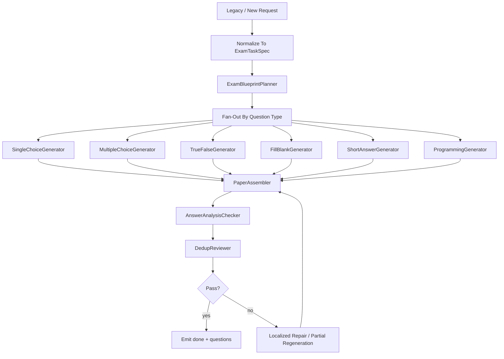

# 试卷功能技术设计文档

## 1. 设计目标

试卷链的设计重点不是长文本写作，而是：

- blueprint 规划
- 题型 fan-out
- checker
- dedup
- 聚合输出

因此这条链非常适合 DeerFlow 风格的多 Agent 并行。

## 2. 旧代码来源

主要参考：

- `/Users/sss/directionai/DirectionAICloud/evoagentx/evo_modules/exam_generator.py`
- `/Users/sss/directionai/DirectionAICloud/evoagentx/evo_modules/question_evaluator.py`
- `/Users/sss/directionai/DirectionAICloud/python-backend/pythonBackend/direction_ai_modules/question_util.py`

取舍原则：

- 保留题型、难度、知识点这些业务语义
- 不保留旧的固定 workflow 结构

## 3. 当前仓库目标落点

```text
backend/packages/directionai/exam/
├─ exam_schemas.py
├─ exam_agents.py
├─ exam_workflow.py
├─ exam_service.py
└─ exam_artifact_builder.py
```

兼容与路由：

```text
backend/app/gateway/routers/exam_router.py
backend/packages/directionai/compat/legacy_request_mapper.py
backend/packages/directionai/compat/legacy_response_mapper.py
backend/packages/directionai/compat/sse_event_mapper.py
```

## 4. 推荐角色模板

### 4.1 `ExamBlueprintPlanner`

职责：

- 理解整张试卷需求
- 确定题型分布
- 确定难度目标
- 确定知识点覆盖计划

### 4.2 各题型 Generator

包括：

- `SingleChoiceGenerator`
- `MultipleChoiceGenerator`
- `TrueFalseGenerator`
- `FillBlankGenerator`
- `ShortAnswerGenerator`
- `ProgrammingGenerator`

职责：

- 只负责本题型生成
- 不直接负责全卷一致性

### 4.3 `AnswerAnalysisChecker`

职责：

- 检查答案和解析是否基本对齐
- 检查字段是否缺失

### 4.4 `DedupReviewer`

职责：

- 检查题目重复
- 检查知识点覆盖重复过高

### 4.5 `PaperAssembler`

职责：

- 合并所有题型结果
- 统一输出顺序与结构

## 5. 推荐工作流



## 6. Fan-out 设计原则

### 6.1 角色模板固定

不建议每次临时发明新题型角色。

### 6.2 实例数量可动态

当某题型数量大时，可以动态开多个相同模板实例。

### 6.3 数量为 0 时不实例化

例如：

- `programming_num = 0`

则不启动编程题 generator。

## 7. Artifact 设计

推荐至少定义：

- `ExamTaskSpec`
- `ExamBlueprintArtifact`
- `QuestionBatchArtifact`
- `ExamPaperArtifact`
- `ExamReviewArtifact`

### 7.1 ExamBlueprintArtifact 建议字段

- `subject`
- `knowledge_points`
- `question_type_plan`
- `difficulty_plan`
- `coverage_plan`

### 7.2 ExamPaperArtifact 建议字段

- `questions`
- `summary`
- `question_type_counts`
- `difficulty_summary`
- `coverage_summary`

## 8. Tool 边界

推荐 tool 类型：

- `rag_tool`
- `exam_validation_tool`
- `dedup_tool`
- `answer_consistency_tool`
- `difficulty_scoring_tool`

## 9. Compatibility API 设计

兼容层至少要做：

1. 接收旧前端 exam 请求字段
2. 归一化成 `ExamTaskSpec`
3. 保持 SSE 事件语义
4. 在 `done` 阶段映射：
   - `questions`
   - 兼容旧字段 `question` / `output.question`

## 10. 状态设计

推荐状态：

- `created`
- `blueprinting`
- `generating`
- `assembling`
- `checking`
- `repairing`
- `completed`
- `failed`

## 11. 错误处理设计

### 11.1 单题型失败

- 允许局部失败
- 允许局部重试
- 不要求整卷全部失败

### 11.2 checker 失败

- 优先触发局部修复
- 例如只重生成重复题型

## 12. 测试设计要求

至少要有：

- `backend/tests/contracts/exam_*`
- `backend/tests/integration/exam_*`
- `backend/tests/regression/exam_*`

重点覆盖：

- 多种题型组合
- 数量为 0 的题型
- SSE chunk 路由
- done questions 兼容
- 局部失败修复
