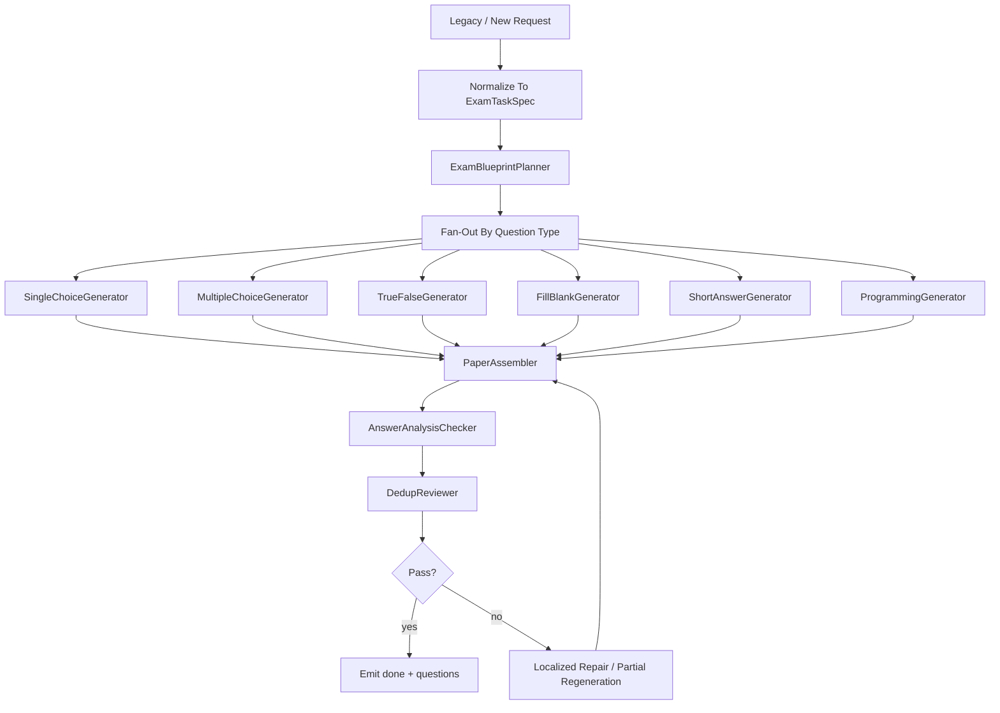

# 试卷功能技术设计文档

## 1. 设计目标

试卷链的设计重点不是长文本写作，而是：

- blueprint 规划
- 题型 fan-out
- checker
- dedup
- 聚合输出

因此这条链非常适合 DeerFlow 风格的多 Agent 并行。

## 2. 旧代码来源

主要参考：

- `/Users/sss/directionai/DirectionAICloud/evoagentx/evo_modules/exam_generator.py`
- `/Users/sss/directionai/DirectionAICloud/evoagentx/evo_modules/question_evaluator.py`
- `/Users/sss/directionai/DirectionAICloud/python-backend/pythonBackend/direction_ai_modules/question_util.py`

取舍原则：

- 保留题型、难度、知识点这些业务语义
- 不保留旧的固定 workflow 结构

## 3. 当前仓库目标落点

```text
backend/packages/directionai/exam/
├─ exam_schemas.py
├─ exam_agents.py
├─ exam_workflow.py
├─ exam_service.py
└─ exam_artifact_builder.py
```

兼容与路由：

```text
backend/app/gateway/routers/exam_router.py
backend/packages/directionai/compat/legacy_request_mapper.py
backend/packages/directionai/compat/legacy_response_mapper.py
backend/packages/directionai/compat/sse_event_mapper.py
```

## 4. DeerFlow Sub-Agent 策略

试卷链明确使用 DeerFlow 的 subagent 能力，而且它是三条链里使用最充分的一条。

但要注意，这里的动态性来自“实例调度”，不是“角色定义再创造”。

### 4.1 试卷链到底有没有用到 DeerFlow 生成 subagent

有。

具体体现在：

- `ExamBlueprintPlanner` 先产出全卷蓝图
- workflow 再按题型和数量实例化不同 generator
- checker / dedup / repair 也可以作为后续固定模板实例加入流程

### 4.2 每次请求的 subagent 会不会不一样

会不一样，但不一样的是“实例组合”，不是“模板类型”。

例如：

- 一次请求可能只启用单选、多选、判断
- 另一次请求可能再加简答和编程
- 某次单选题很多，可能会开 2 到 3 个 `SingleChoiceGenerator` 实例

但这些实例全部来自固定模板库。

不会出现：

- 这次临时发明一个“机器学习理论分析题专家”
- 下次再临时发明一个“高校考试命题评估专家”

### 4.3 为什么试卷链最适合这样做

因为试卷链天然具备：

- 蓝图规划和执行分离
- 按题型 fan-out 并行
- 局部失败可局部回炉
- 结果最后必须回到统一 assembler

这正好对应 DeerFlow subagent 的强项。

## 5. 推荐角色模板

### 5.1 `ExamBlueprintPlanner`

职责：

- 理解整张试卷需求
- 确定题型分布
- 确定难度目标
- 确定知识点覆盖计划

### 5.2 各题型 Generator

包括：

- `SingleChoiceGenerator`
- `MultipleChoiceGenerator`
- `TrueFalseGenerator`
- `FillBlankGenerator`
- `ShortAnswerGenerator`
- `ProgrammingGenerator`

职责：

- 只负责本题型生成
- 不直接负责全卷一致性

### 5.3 `AnswerAnalysisChecker`

职责：

- 检查答案和解析是否基本对齐
- 检查字段是否缺失

### 5.4 `DedupReviewer`

职责：

- 检查题目重复
- 检查知识点覆盖重复过高

### 5.5 `PaperAssembler`

职责：

- 合并所有题型结果
- 统一输出顺序与结构

### 5.6 固定模板注册要求

这些角色都必须在 exam 域中作为固定模板注册。

推荐做法：

- `exam_agents.py` 中定义题型模板注册表
- `exam_workflow.py` 中按 blueprint 和 question_counts 选择实例化策略
- `exam_service.py` 中只调度模板，不现场生成新的角色定义

## 6. 推荐工作流



## 7. Fan-out 设计原则

### 7.1 角色模板固定

不建议每次临时发明新题型角色。

### 7.2 实例数量可动态

当某题型数量大时，可以动态开多个相同模板实例。

### 7.3 数量为 0 时不实例化

例如：

- `programming_num = 0`

则不启动编程题 generator。

### 7.4 动态的边界

允许动态的内容：

- 哪些题型参与本次生成
- 同一题型开几个实例
- 哪些 checker / dedup / repair 实例被启用

不允许动态的内容：

- 新题型角色定义
- 新 checker 类型定义
- 未经文档确认的角色 schema

## 8. Artifact 设计

推荐至少定义：

- `ExamTaskSpec`
- `ExamBlueprintArtifact`
- `QuestionBatchArtifact`
- `ExamPaperArtifact`
- `ExamReviewArtifact`

### 8.1 ExamBlueprintArtifact 建议字段

- `subject`
- `knowledge_points`
- `question_type_plan`
- `difficulty_plan`
- `coverage_plan`

### 8.2 ExamPaperArtifact 建议字段

- `questions`
- `summary`
- `question_type_counts`
- `difficulty_summary`
- `coverage_summary`

## 9. Tool 边界

推荐 tool 类型：

- `rag_tool`
- `exam_validation_tool`
- `dedup_tool`
- `answer_consistency_tool`
- `difficulty_scoring_tool`

### 9.1 Tool 与 subagent 的关系

试卷链里的各类 generator 可以共享工具，但不能把工具调用结果直接等价成“新角色定义”。

例如：

- 可以让 `ProgrammingGenerator` 调用 `rag_tool`
- 可以让 `DedupReviewer` 调用 `dedup_tool`
- 但不能因为某次检索结果复杂，就临时创建一个新的“知识点聚类专家”角色，除非先更新文档并正式进入固定模板库

## 10. Compatibility API 设计

兼容层至少要做：

1. 接收旧前端 exam 请求字段
2. 归一化成 `ExamTaskSpec`
3. 保持 SSE 事件语义
4. 在 `done` 阶段映射：
   - `questions`
   - 兼容旧字段 `question` / `output.question`

## 11. 状态设计

推荐状态：

- `created`
- `blueprinting`
- `generating`
- `assembling`
- `checking`
- `repairing`
- `completed`
- `failed`

## 12. 错误处理设计

### 12.1 单题型失败

- 允许局部失败
- 允许局部重试
- 不要求整卷全部失败

### 12.2 checker 失败

- 优先触发局部修复
- 例如只重生成重复题型

## 13. 测试设计要求

至少要有：

- `backend/tests/contracts/exam_*`
- `backend/tests/integration/exam_*`
- `backend/tests/regression/exam_*`

重点覆盖：

- 多种题型组合
- 数量为 0 的题型
- SSE chunk 路由
- done questions 兼容
- 局部失败修复
- 固定模板注册与 fan-out 数量是否符合 blueprint
- repair 是否只复用既有模板

## 14. 明确禁止的实现方式

下面这些都不应在试卷链里出现：

- 每次请求根据题目主题动态设计新的题型角色
- 把题型、checker、assembler 全部混进一个大 prompt
- 为了实现 fan-out，直接在 workflow 里拼接未经注册的新角色定义
- 让 `PaperAssembler` 回头负责重新命题，破坏职责边界
