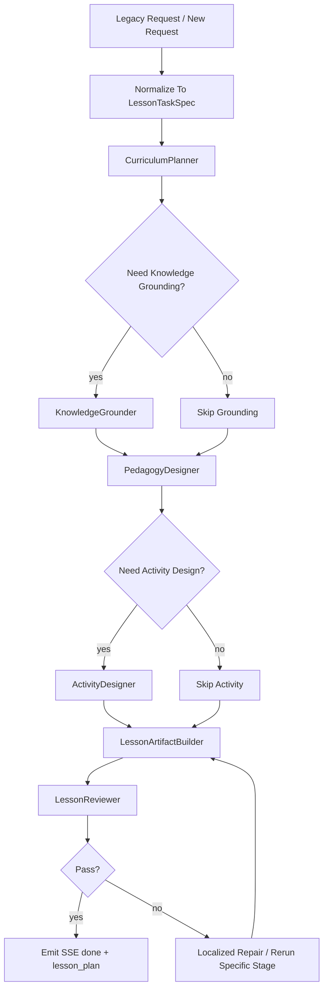

# 教案功能技术设计文档

## 1. 设计目标

教案链的技术设计要解决三个问题：

1. 摆脱旧 `evoagentx` 的固定 workflow 组织方式
2. 让 lesson 输出变成稳定 artifact，而不是纯文本拼接
3. 让 lesson 链天然适配组合任务中的上游角色

## 2. 旧代码来源与参考价值

教案链重构时主要参考以下旧代码：

- `/Users/sss/directionai/DirectionAICloud/evoagentx/evo_modules/lesson_generator.py`
- `/Users/sss/directionai/DirectionAICloud/evoagentx/evo_modules/lesson_plan_evaluator.py`
- `/Users/sss/directionai/DirectionAICloud/evoagentx/evo_modules/faiss_toolkit.py`
- `/Users/sss/directionai/DirectionAICloud/python-backend/pythonBackend/direction_ai_modules/llm_connector.py`

取舍原则：

- 保留业务语义
- 保留输入字段语义
- 保留 RAG 增强经验
- 不保留旧 workflow JSON 作为未来结构约束

## 3. 当前仓库内的目标落点

推荐把 lesson 链实现放到以下位置：

```text
backend/packages/directionai/lesson/
├─ lesson_schemas.py
├─ lesson_agents.py
├─ lesson_workflow.py
├─ lesson_service.py
└─ lesson_artifact_builder.py
```

兼容层放：

```text
backend/app/gateway/routers/lesson_router.py
backend/packages/directionai/compat/legacy_request_mapper.py
backend/packages/directionai/compat/legacy_response_mapper.py
backend/packages/directionai/compat/sse_event_mapper.py
```

## 4. DeerFlow Sub-Agent 策略

教案链明确使用 DeerFlow 的 subagent 能力，但这里只允许“固定模板实例化”，不允许“每次请求现造一套新角色”。

必须遵守下面几条：

1. 角色类型固定
2. 角色名称固定
3. 角色输入输出 schema 固定
4. 运行时只决定启用哪些角色实例
5. repair 只能复用既有角色模板

### 4.1 教案链到底有没有用到 DeerFlow 生成 subagent

有。

但“生成”在这里指的是：

- DeerFlow 在运行时实例化既有角色模板
- DeerFlow 根据任务复杂度决定是否启用某些模板
- DeerFlow 在局部失败时重新拉起某个固定模板实例做修复

不指的是：

- 主 Agent 每次读完用户输入后，重新设计一组新的角色定义
- 主 Agent 自己发明新的课程专家、写作专家、审核专家名字和职责

### 4.2 为什么教案链适合用这种方式

因为教案链同时有两种特征：

- 它确实需要拆出不同职责，如课程结构规划、知识增强、教学设计、活动设计、review
- 但这些职责长期稳定，不会因为某门课换了主题就变成另一套全新职业分工

所以最合理的方式是：

- 固定一组 lesson subagent 模板
- 每次请求按需要启用其中一部分

### 4.3 哪些地方是动态的

动态的是：

- 是否启用 `KnowledgeGrounder`
- 是否启用 `ActivityDesigner`
- reviewer 不通过时是否再次实例化某个修复角色

不是动态的：

- 角色定义
- 角色职责边界
- 角色的输入输出 schema
- 角色可调用工具集合

## 5. 角色与职责设计

推荐固定角色模板，不建议每次临时造新角色。

### 5.1 `CurriculumPlanner`

职责：

- 理解课程、单元、课时和附加要求
- 产出教案一级结构
- 决定需要哪些下游环节

输入：

- `LessonTaskSpec`

输出：

- `LessonPlanOutlineArtifact`

### 5.2 `KnowledgeGrounder`

职责：

- 调用 RAG / 文档解析 / 检索工具
- 汇总知识增强结果

输入：

- 课程信息
- 知识资料
- 上传文档

输出：

- `LessonKnowledgeContextArtifact`

### 5.3 `PedagogyDesigner`

职责：

- 生成教学目标、重点难点、教学方法、理论内容主线

输出：

- `LessonPedagogyArtifact`

### 5.4 `ActivityDesigner`

职责：

- 生成课堂活动、案例、实践、实验或作业设计

输出：

- `LessonActivityArtifact`

### 5.5 `LessonReviewer`

职责：

- 检查结构完整性
- 检查是否满足字数和附加要求
- 检查是否适合作为下游输入

输出：

- `LessonReviewArtifact`

### 5.6 固定模板注册要求

这些角色必须以固定模板的形式注册在 lesson 域代码里，而不是散落在 prompt 字符串中。

推荐最小注册方式：

- `lesson_agents.py` 中定义角色模板常量或注册器
- `lesson_workflow.py` 中只负责任务到角色实例的映射
- `lesson_service.py` 中不直接现场创建新的角色定义

## 6. 推荐工作流



### 6.1 工作流中的 subagent 实例化规则

推荐按下面规则实例化：

- 每次请求都实例化 `CurriculumPlanner`
- `use_rag=true` 或存在上传文档时，实例化 `KnowledgeGrounder`
- 课程包含实验、案例、项目制等强实践要求时，实例化 `ActivityDesigner`
- 每次请求都实例化 `LessonReviewer`
- reviewer 失败时，只回炉失败部分对应的固定模板实例

## 7. 内部数据结构设计

### 7.1 核心 TaskSpec

推荐定义：

- `LessonTaskSpec`

核心字段至少包括：

- `request_id`
- `course`
- `units`
- `lessons`
- `constraint`
- `word_limit`
- `use_rag`
- `model_profile`
- `source_documents`
- `target_outputs`

### 7.2 核心 Artifact

推荐定义：

- `LessonPlanOutlineArtifact`
- `LessonKnowledgeContextArtifact`
- `LessonPedagogyArtifact`
- `LessonActivityArtifact`
- `LessonPlanArtifact`
- `LessonReviewArtifact`

### 7.3 最终 LessonPlanArtifact 建议字段

至少建议包含：

- `title`
- `course`
- `units`
- `lessons`
- `teaching_objectives`
- `key_points`
- `difficult_points`
- `teaching_methods`
- `teaching_process`
- `activities`
- `summary`
- `assignments`
- `markdown_content`
- `downstream_context`

## 8. Tool 边界

教案链推荐使用的 Tool 类型：

### 8.1 `rag_tool`

职责：

- 知识库检索
- 返回结构化检索结果

### 8.2 `document_parser_tool`

职责：

- 上传资料内容抽取
- 返回结构化文本 / 摘要 / 元数据

### 8.3 `lesson_export_tool`

职责：

- 教案 markdown / docx / pdf 导出

### 8.4 `lesson_validation_tool`

职责：

- 结构完整性检测
- 字数约束检测
- 关键 sections 检测

## 9. Skill 边界

Skill 适合承载：

- 教案写作风格
- 教学设计原则
- review checklist
- 领域化写作约束

Skill 不适合承载：

- request schema
- 业务状态机
- 导出逻辑
- RAG 实现细节

### 9.1 Skill 与 subagent 的关系

这里要明确区分：

- skill 用来描述某个角色怎么做事
- subagent 用来承载某个角色在 workflow 中的职责

因此：

- 可以给 `PedagogyDesigner` 绑定一个教学设计 skill
- 可以给 `LessonReviewer` 绑定一个 review checklist skill
- 但不能把“要不要有 `ActivityDesigner`”这种编排决策藏进 skill 文本里

## 10. Compatibility API 设计

lesson 兼容层至少要做：

1. 接收旧前端 lesson 请求字段
2. 归一化成 `LessonTaskSpec`
3. 驱动 SSE：
   - `thinking_start`
   - `thinking_chunk`
   - `thinking_end`
   - `progress`
   - `done`
   - `error`
4. 在 `done` 阶段映射：
   - `lesson_plan`

## 11. 状态设计

推荐 lesson 链内部阶段状态：

- `created`
- `planning`
- `grounding`
- `designing`
- `assembling`
- `reviewing`
- `repairing`
- `completed`
- `failed`

## 12. 明确禁止的实现方式

下面这些都不应在教案链里出现：

- 每次请求都先让主 Agent 生成一段新的角色定义 markdown，再按这段 markdown 去运行
- 根据课程名动态拼接出一个以前不存在的 lesson 角色名
- 让 `LessonReviewer` 直接承担所有生成工作，导致角色边界失真
- 为了省事把所有阶段合并回一个大 prompt

## 13. 测试补充要求

除了常规 contract / integration / regression test 外，还要增加以下验证：

- 固定角色模板注册是否完整
- 不同输入下启用的角色实例集合是否符合预期
- repair 是否只复用既有模板，而不是创建未知角色
