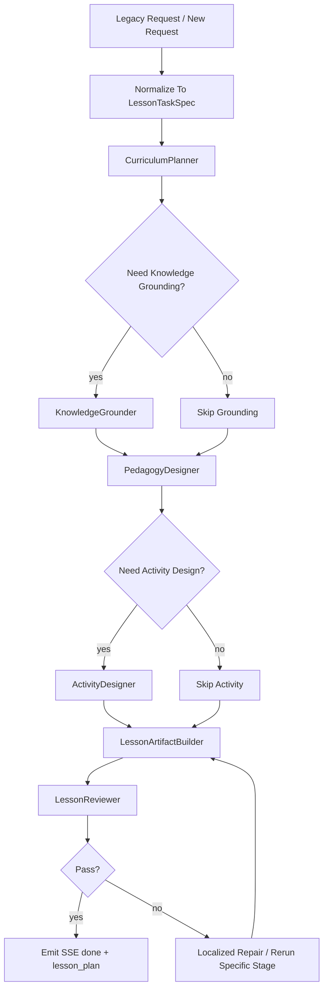

# 教案功能技术设计文档

## 1. 设计目标

教案链的技术设计要解决三个问题：

1. 摆脱旧 `evoagentx` 的固定 workflow 组织方式
2. 让 lesson 输出变成稳定 artifact，而不是纯文本拼接
3. 让 lesson 链天然适配组合任务中的上游角色

## 2. 旧代码来源与参考价值

教案链重构时主要参考以下旧代码：

- `/Users/sss/directionai/DirectionAICloud/evoagentx/evo_modules/lesson_generator.py`
- `/Users/sss/directionai/DirectionAICloud/evoagentx/evo_modules/lesson_plan_evaluator.py`
- `/Users/sss/directionai/DirectionAICloud/evoagentx/evo_modules/faiss_toolkit.py`
- `/Users/sss/directionai/DirectionAICloud/python-backend/pythonBackend/direction_ai_modules/llm_connector.py`

取舍原则：

- 保留业务语义
- 保留输入字段语义
- 保留 RAG 增强经验
- 不保留旧 workflow JSON 作为未来结构约束

## 3. 当前仓库内的目标落点

推荐把 lesson 链实现放到以下位置：

```text
backend/packages/directionai/lesson/
├─ lesson_schemas.py
├─ lesson_agents.py
├─ lesson_workflow.py
├─ lesson_service.py
└─ lesson_artifact_builder.py
```

兼容层放：

```text
backend/app/gateway/routers/lesson_router.py
backend/packages/directionai/compat/legacy_request_mapper.py
backend/packages/directionai/compat/legacy_response_mapper.py
backend/packages/directionai/compat/sse_event_mapper.py
```

## 4. 角色与职责设计

推荐固定角色模板，不建议每次临时造新角色。

### 4.1 `CurriculumPlanner`

职责：

- 理解课程、单元、课时和附加要求
- 产出教案一级结构
- 决定需要哪些下游环节

输入：

- `LessonTaskSpec`

输出：

- `LessonPlanOutlineArtifact`

### 4.2 `KnowledgeGrounder`

职责：

- 调用 RAG / 文档解析 / 检索工具
- 汇总知识增强结果

输入：

- 课程信息
- 知识资料
- 上传文档

输出：

- `LessonKnowledgeContextArtifact`

### 4.3 `PedagogyDesigner`

职责：

- 生成教学目标、重点难点、教学方法、理论内容主线

输出：

- `LessonPedagogyArtifact`

### 4.4 `ActivityDesigner`

职责：

- 生成课堂活动、案例、实践、实验或作业设计

输出：

- `LessonActivityArtifact`

### 4.5 `LessonReviewer`

职责：

- 检查结构完整性
- 检查是否满足字数和附加要求
- 检查是否适合作为下游输入

输出：

- `LessonReviewArtifact`

## 5. 推荐工作流



## 6. 内部数据结构设计

## 6.1 核心 TaskSpec

推荐定义：

- `LessonTaskSpec`

核心字段至少包括：

- `request_id`
- `course`
- `units`
- `lessons`
- `constraint`
- `word_limit`
- `use_rag`
- `model_profile`
- `source_documents`
- `target_outputs`

## 6.2 核心 Artifact

推荐定义：

- `LessonPlanOutlineArtifact`
- `LessonKnowledgeContextArtifact`
- `LessonPedagogyArtifact`
- `LessonActivityArtifact`
- `LessonPlanArtifact`
- `LessonReviewArtifact`

### 6.3 最终 LessonPlanArtifact 建议字段

至少建议包含：

- `title`
- `course`
- `units`
- `lessons`
- `teaching_objectives`
- `key_points`
- `difficult_points`
- `teaching_methods`
- `teaching_process`
- `activities`
- `summary`
- `assignments`
- `markdown_content`
- `downstream_context`

## 7. Tool 边界

教案链推荐使用的 Tool 类型：

### 7.1 `rag_tool`

职责：

- 知识库检索
- 返回结构化检索结果

### 7.2 `document_parser_tool`

职责：

- 上传资料内容抽取
- 返回结构化文本 / 摘要 / 元数据

### 7.3 `lesson_export_tool`

职责：

- 教案 markdown / docx / pdf 导出

### 7.4 `lesson_validation_tool`

职责：

- 结构完整性检测
- 字数约束检测
- 关键 sections 检测

## 8. Skill 边界

Skill 适合承载：

- 教案写作风格
- 教学设计原则
- review checklist
- 领域化写作约束

Skill 不适合承载：

- request schema
- 业务状态机
- 导出逻辑
- RAG 实现细节

## 9. Compatibility API 设计

lesson 兼容层至少要做：

1. 接收旧前端 lesson 请求字段
2. 归一化成 `LessonTaskSpec`
3. 驱动 SSE：
   - `thinking_start`
   - `thinking_chunk`
   - `thinking_end`
   - `progress`
   - `done`
   - `error`
4. 在 `done` 阶段映射：
   - `lesson_plan`

## 10. 状态设计

推荐 lesson 链内部阶段状态：

- `created`
- `planning`
- `grounding`
- `designing`
- `reviewing`
- `repairing`
- `completed`
- `failed`
- `cancelled`

不允许：

- `completed -> planning`
- `failed -> designing`

## 11. 错误处理设计

### 11.1 检索失败

- 允许降级继续生成
- 在 trace 中标记 RAG 降级

### 11.2 reviewer 失败

- 优先局部回炉
- 不直接整条链重跑

### 11.3 schema 校验失败

- 视为高优先级错误
- 应进入 repair 或中断

## 12. 测试设计要求

至少要有：

- `backend/tests/contracts/lesson_*`
- `backend/tests/integration/lesson_*`
- `backend/tests/regression/lesson_*`

应覆盖：

- legacy request mapping
- SSE contract
- final `lesson_plan` field
- with / without RAG
- long constraint
- empty optional fields

## 13. 实施顺序建议

1. 先补 lesson schemas
2. 再补 legacy request mapper
3. 再补 lesson workflow 和 agents
4. 再补 artifact builder
5. 再补 lesson router / SSE mapping
6. 最后补 tests 和回归
