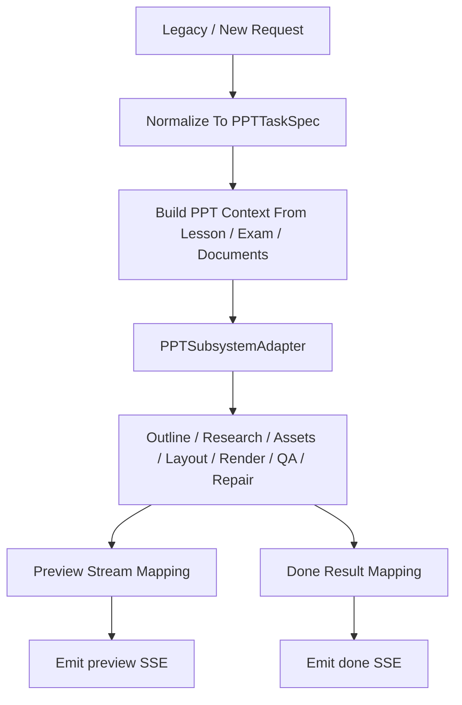

# PPT 功能技术设计文档

## 1. 设计原则

PPT 链的重构目标不是“把所有逻辑统一成 DeerFlow Agent”，而是：

1. 用 DeerFlow 接管编排层
2. 保留 PPT 专用子系统的成熟工程能力
3. 通过 Compatibility API 对接旧前端

## 2. 主基线来源

PPT 子系统的主基线来自：

- `/Users/sss/directionai/directionai_pptagent`

而不是旧的：

- `/Users/sss/directionai/DirectionAICloud/pptagent`
- `/Users/sss/directionai/DirectionAICloud/evoagentx/evo_modules/ppt_generator.py`

旧代码的作用主要是：

- 参考旧前端兼容字段
- 参考旧联调方式

## 3. 当前仓库目标落点

推荐目录：

```text
backend/packages/directionai/ppt/
├─ ppt_schemas.py
├─ ppt_request_builder.py
├─ ppt_subsystem_adapter.py
├─ ppt_result_mapper.py
└─ ppt_trace_service.py
```

配套路由：

```text
backend/app/gateway/routers/ppt_router.py
backend/app/gateway/routers/compatibility_router.py
```

## 4. 系统分层

### 4.1 编排层

由 DeerFlow / DirectionAI workflow 负责：

- 判断是否需要生成 PPT
- 组织 lesson / exam / document 上下文
- 生成标准 `PPTTaskSpec`

### 4.2 子系统适配层

由 `ppt_subsystem_adapter.py` 负责：

- 把 `PPTTaskSpec` 转成 `directionai_pptagent` 可执行请求
- 调起专用 PPT runtime
- 接收 preview / done / trace

### 4.3 兼容层

由 router + mapper 负责：

- 兼容旧前端请求字段
- 兼容旧前端结果字段
- 兼容旧前端 SSE 事件

## 5. 推荐工作流



## 6. 不同于 lesson / exam 的地方

### 6.1 PPT 不建议拆成大量业务 Agent 自由发挥

lesson / exam 可以做原生多 Agent 化。  
PPT 不建议照这个思路走。

### 6.2 PPT 更像专用引擎

PPT 的核心难点在于：

- layout
- render
- preview
- syntax repair
- content QA
- visual QA
- benchmark / promotion / learned memory

这些都更像专用工程系统，而不是通用 Prompt 问题。

## 7. 应优先迁入的 `directionai_pptagent` 能力

应优先保留：

- `api.py` 中的兼容请求规范
- `backend/harness/agents/orchestrator`
- `backend/harness/runtime/*`
- `backend/models/schemas.py`
- `backend/tools/*`
- trace / preview / repair / benchmark 相关逻辑

## 8. 当前兼容字段映射

来自 `directionai_pptagent/api.py` 的重要兼容字段包括：

- `language -> output_language`
- `audience -> target_audience`
- `slides -> min_slides/max_slides`
- `page_limit -> min_slides/max_slides`
- `use_rag -> enable_web_search`
- `course/units/lessons/knowledge_points/constraint -> topic derivation`
- `document_text/document_name`

这套兼容逻辑建议复用，而不是重新发明。

## 9. Artifact 设计

推荐至少定义：

- `PPTTaskSpec`
- `PPTGenerationRequestArtifact`
- `PPTGenerationResultArtifact`
- `PPTTraceArtifact`

## 10. Tool 边界

PPT 相关工具应至少包括：

- 文档摘要 / 文档提取
- outline 规划
- asset 检索 / 生图
- layout / render
- preview 生成
- QA
- repair
- trace / benchmark

但这些工具不应全部暴露给通用 Lead Agent 直接自由调用。

## 11. Compatibility API 设计

必须兼容的行为：

- `POST /stream_ppt`
- `POST /generate_ppt`
- `POST /upload_document`
- `POST /evaluate/ppt`
- `GET /download_ppt/{filename}`
- `GET /preview_ppt/{filename}/{image_name}`

是否对外沿用相同路径，可以通过旧仓的 Nginx / BFF 层继续做映射。

## 12. 测试设计

至少要有：

- `backend/tests/contracts/ppt_*`
- `backend/tests/integration/ppt_*`
- `backend/tests/regression/ppt_*`

重点覆盖：

- request compatibility normalization
- preview event payload
- done payload
- download / preview url
- no-preview fallback
- upload document path
- trace presence
